\newpage

# 本月计划 {.unnumbered}

1.  第一篇论文修改完成（30日前返回修改意见）

2.  讨论班认真上课（华师大汤老师讨论班）

3.  翻译（第2，3章）------一共四章

4.  11月底找一次狗子

5.  接单捞钱（2000）

6.  积极参加篮球赛

**第二篇论文《序进加速寿命试验的广义推断》写完初稿**（）

4.  看一本课外书籍（解忧杂货店），养养花，养养鱼。

5.  公众号（每周三篇文章）+ 学习

6.  学习新技能（MCMC，贝叶斯，R可视化，R编程，python打基础）------（待扩展）

```{r}
date()
```

\newpage

# 2020.11.01（周日 公众号 + 浑水摸鱼（王者开黑5v5）+ 论文瞎搞 + 洗衣服睡觉）

## 今日所思

-   又是玩的一天，又不敢找老师，自己有解决不了问题。。我真的卡住不想动
    非常消极。。

# 2020.11.02（周一 和老师讨论代码 + 修改代码 + 王者 + 《解忧杂货店》看完 + 打球）

## 今日所学

### 接单------用R绘图

[他们的作业任务](assignment1-1.pdf)

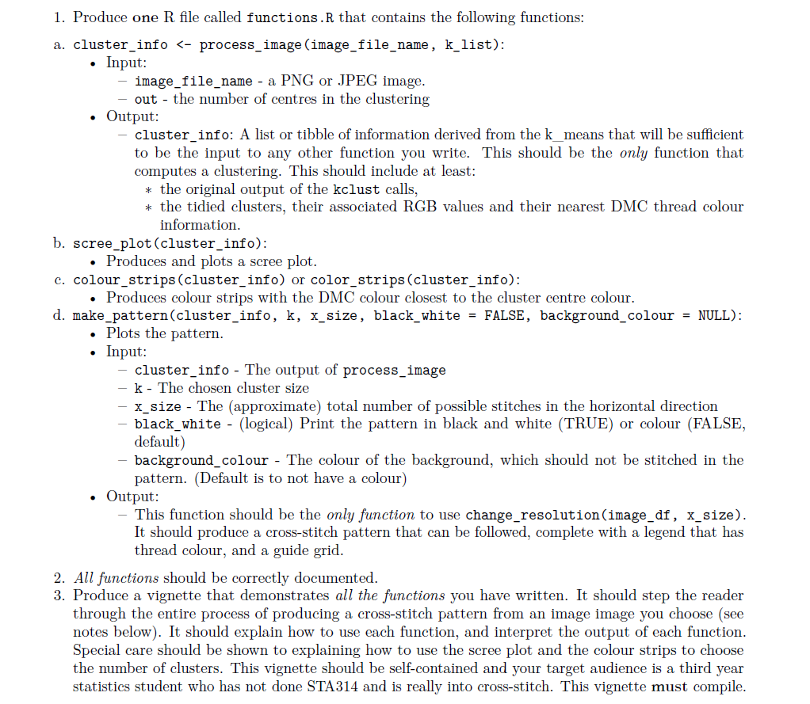

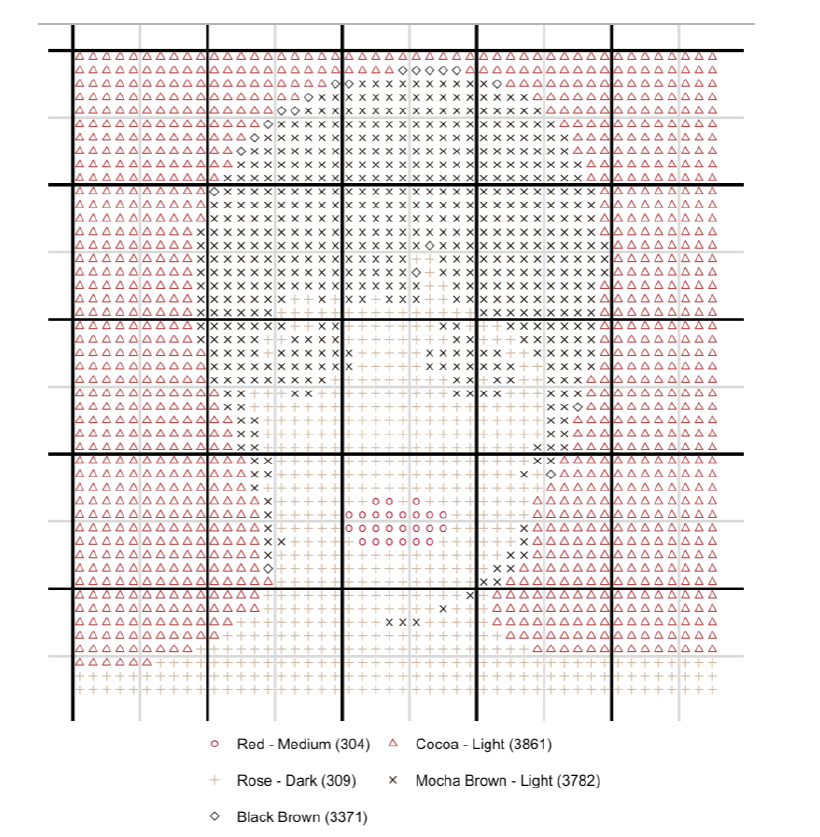

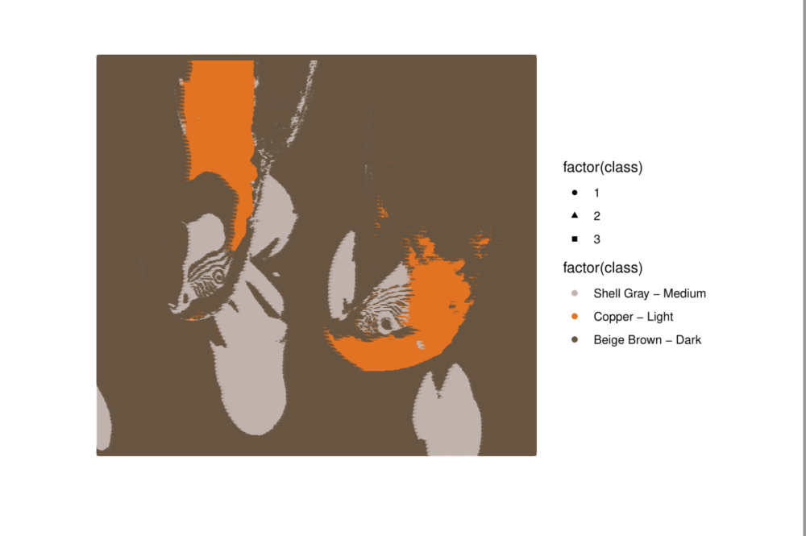

### 公众号第一笔钱!!!

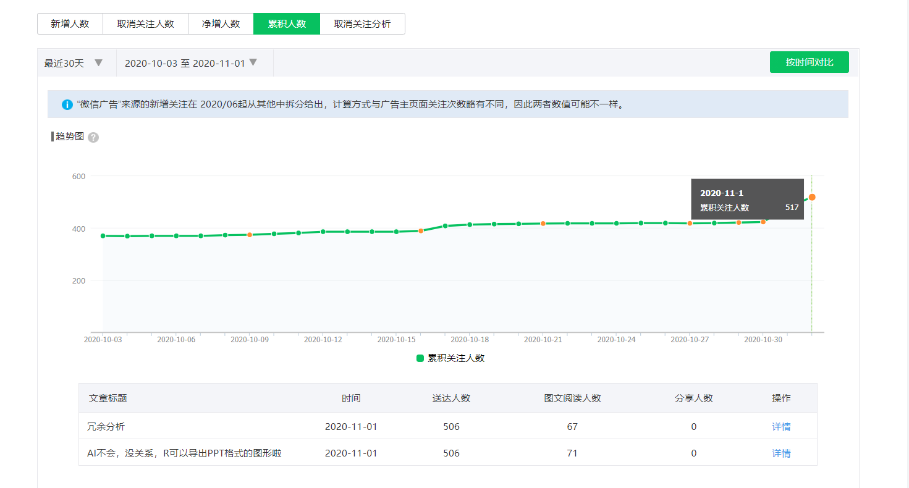

粉丝超过500可以赚钱啦！，今天是第一天，能有几块赚非常开心！！说明前段时间的坚持还是有收获的。

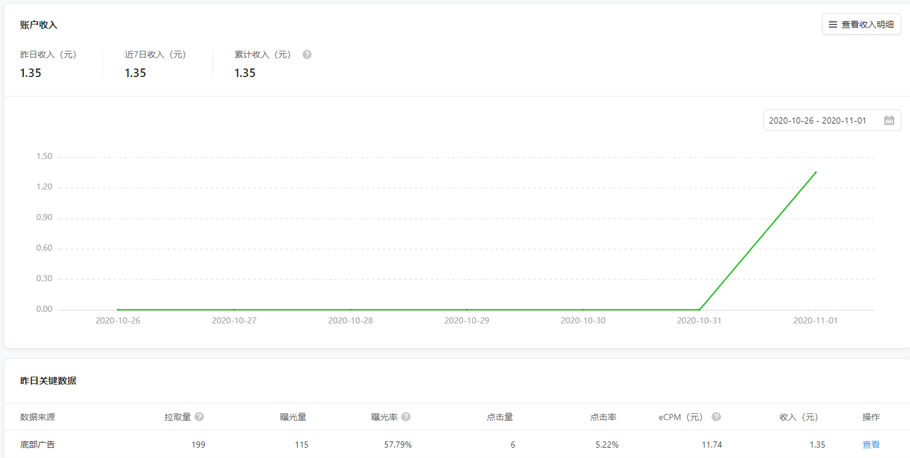

### 论文事宜

-   今天和老师讨论了下代码的问题，老师给了一个很关键的建议。把参数进行改变，使用重度截尾数据来进行模拟。于是我使用了beta=8，beta=5的情况进行模拟。期间存在一定问题:

    -   TS方法的置信区间算不出来（hessian矩阵的逆=协方差矩阵，方差有的都为0了），解决方法：加了一个abs()。tp的结果有的数据也有点问题，我也是用了abs进行（-0.0001这种）加个绝对值还是没事的。

    -   BS还是使用原来的数据进行模拟（双重bs方法），前面的数据就不改了。为啥rmse不随着n的增加而等大，这个原因有可是：计算rmse错误的原因（eta是会变得）。但是后面的mu，sigma其实也有问题，但是不是这个问题了。这个不是很清楚。很有可能是，beta=4，n=500当时跑不出结果来，我只用了几次模拟就拿来当结果的原因把。非常有可能！！！

    -   一区！！！耶稣让我发过去吧！研究生的第一篇文章可不能这么凉了！花了整整一年时间呢！！！

    ### 《解忧杂货店》看完了

    现代人内心流失的东西，这家杂货店能帮你找回------

僻静的街道旁有一家杂货店，只要写下烦恼投进卷帘门的投信口，第二天就会在店后的牛奶箱里得到回答。

因男友身患绝症，年轻女孩静子在爱情与梦想间徘徊；克郎为了音乐梦想离家漂泊，却在现实中寸步难行；少年浩介面临家庭巨变，挣扎在亲情与未来的迷茫中......

他们将困惑写成信投进杂货店，随即奇妙的事情竟不断发生。

生命中的一次偶然交会，将如何演绎出截然不同的人生？

如今回顾写作过程，我发现自己始终在思考一个问题：站在人生的岔路口，人究竟应该怎么做？我希望读者能在掩卷时喃喃自语：我从未读过这样的小说。------东野圭吾

#### 目录

第一章 回答在牛奶箱里

第二章 深夜的口琴声

第三章 在思域车上等到天亮

第四章 听着披头士默祷

第五章 来自天上的祈祷

#### 影评

版权归作者所有，任何形式转载请联系作者。 作者：丁小叮（来自豆瓣）
来源：<https://book.douban.com/review/7362523/>

小偷三人组。 1980年7月
松冈克郎在浪矢杂货店碰见月兔（静子，击剑女运动员），当时月兔（静子，击剑女运动员）正往里投放感谢信。（此封感谢信由小偷三人组收到）克郎因此得知浪矢杂货店还可以咨询，于是以"鱼店音乐人"的名义写信问"是应该坚持音乐梦想还是继承鱼店"，小偷三人组回复了此信。

1980年9月
"迷途的小狗"（武藤晴美）从月兔（静子，击剑女运动员）口中得知浪矢杂货店，于是写信咨询，询问"如何辞掉工作做好陪酒小姐"，小偷三人组回复此信。

1980年9月13日 雄治病逝。

1980年10月
贵之在浪矢杂货店遇到月兔（静子，击剑女运动员），告知父亲去世的消息。月兔称去年11月曾得到过其父的指点，表示感谢。那时雄治正在医院治疗，因此贵之以为月兔弄错了时间。

1988年12月24日
丸光园发生火宅，"鱼店音乐人"松冈克郎为救人丧命。浩介和武藤晴美相遇。随后浩介又在浪矢杂货店遇到贵之，得知8年前雄治去世的消息。
2011年底 浪矢贵之去世。

2012年9月 浪矢骏吾在网上发布"浪矢杂货店复活"的消息。

2012年9月12日 小偷三人组打劫了"迷途的小狗"武藤晴美的别墅。

2012年9月13日0点-黎明
小偷三人组收到了来自过去的"月兔"、"鱼店音乐人"、"迷途的小狗"的来信，并一一认真回复。

【关于33周年忌日的问题】：

感谢回复的豆油们，对于此话题重新更新下，我之前的理解有误，原文没有问题，确实是33周年祭日。

浪矢雄治给贵之遗书的时候，当时是1979年9月13日，雄治以为自己即将死亡，所以提出要快到自己33周年忌日时发布复活的消息。（详情可参见P120页）而实际上，雄治是1980年9月13日死亡的。而此后文中提到的都是，"据说是浪矢杂货店主人33周年的忌日。"
1980年为老爷爷的第1个忌日，2012年为他的第33个忌日。这个没有问题，抱歉我之前理解错误，提出应该是32周年忌日的说法是错误的。

P288页武藤晴美给浪矢杂货店的感谢信："据网站上説，今晚是您的33周年忌日，而我写信向您咨询，正是32年前的这个时候。这么说来，我应该是最后一个咨询者。"从这里也可以看出来，武藤写感谢信是在2012年，32年前为1980年，符合小说中的时间设定。

再次感谢大家指出！

【关于后门】：（[感谢楼下的豆友们\@被门夹过的核桃以及\@Miss](mailto:感谢楼下的豆友们@被门夹过的核桃以及@Miss){.email}
Fantasy，我又认真看了原文，并再次修改）
文中多次提到，"关着后门，时间就不会流逝。"
P32中提到，敦也花了大约15分钟外出去便利店买吃的，幸平却说已经一个多小时了。
也就是说，如果把后门敞开，屋里和屋外的时间就同步了。
而关上门，则可以连通现在与过去。
这样看来，只有在关上门的时候，1979年9月浪矢雄治才能收到来自未来2012年9月的信，而小偷三人组才能收到来自以前的信。
最后敦也在关闭后门的情况下寄出的那封空白信也被浪矢雄治收到，而这也是浪矢雄治此生最后的咨询。

【人物关系简介】

浪矢雄治：浪矢杂货店的老板，为人们解答烦恼

浪矢贵之：雄治的儿子

浪矢骏吾：贵之的孙子

皆月晓子：丸光园创始人，年少时和浪矢雄治私奔失败，终生未婚

和久浩介："保罗.列侬"，初中时父母双亡，后以"藤川博"名义生活，曾在丸光园生活,最终成为职业木雕师

川边绿："绿河"，爱上有妇之夫，未婚先孕，最终坠海身亡，留下一岁左右的女儿
静子："月兔"，职业为击剑运动员

松冈克郎："鱼店音乐人"，曾就读于东京某大学经济学院，21岁退学，1988年圣诞儿童福利院"丸光园"演出，为救一个小男孩（水原芹的弟弟）而在大火中牺牲，留下作品《重生》

武藤晴美："迷途的小狗"，小狗事务所社长，曾在丸光园生活，后因得到浪矢杂货店指点而投资房地产、股票以及高尔夫会员证等，积累巨大财富

水原芹：天才女音乐人，因演唱《重生》而出名

荣美子：克郎的妹妹

加奈子：克郎的母亲

松冈健夫：克郎的父亲

翔太：小偷三人组成员，曾在丸光园生活,被供职的家电商场炒了鱿鱼，靠给便利店打工勉强度日。

敦也：小偷三人组成员，曾在丸光园生活,母亲是陪酒小姐，父亲为同一家店的服务生，没等他出生就消失的无影无踪。母亲身边换过无数男人，也因此使得他遭到有暴力倾向的男人毒打，他不得已去偷小摊上的烤鸡肉被抓，之后被送到孤儿院丸光园。他曾在配件加工厂上班，因为新型配件订单出差错而背黑锅。

幸平：小偷三人组成员，曾在丸光园生活,身材高大，因其工作的汽车修理厂倒闭而失业，住在工厂宿舍，随时可能会被扫地出门。

\#\#\# 用R将图片转为字符画

想获取本文完整代码和数据的下载链接，可关注微信公众号"R语言和Python学堂"，并回复发文日期"20181129"。

[用R将图片转为字符画](https://zhuanlan.zhihu.com/p/51153590)

这么好玩的东西，要学一下然后实现以下，做一个自己的表情包和头像

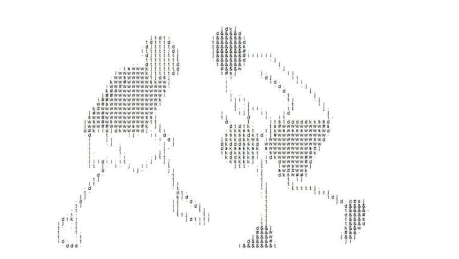

\#\# 今日所思

-   现在是晚上8：30，约了承业9点的篮球，代码应该没啥问题，等会用两个电脑跑跑看看。

-   今天把单子做做完(后面是真的不会了，特别是怎么加框！怎么变成他那种，会有这么多分开的空格。这里卡死了，主要是他给的代码太少了，只给了具体流程，建什么函数，用了什么包，具体包里的函数沙俄都没有说。这个对于我来说真的太难了)

# 2020.11.03（周二 早上放假寝室王者8连胜 + 做单子（绘图） + 打球）

## 今日所学------用R语言画图（ggplot+dmc+...）

### load packages

```{r}
library(imager)
library(tidyverse)
library(tidymodels)
library(sp)
library(scales)
library(cowplot)
#devtools::install_github("sharlagelfand/dmc")
library(dmc)
```

```{r }
source('functions.R') 
```

### load a image

Load the image that is from "./avatar.jpg".

```{r}
image_file_name = "./avatar.jpg"
```


\newpage

### process_image

To process the original image data, use the `kmeans` method to divide
the R, G, and B data into k categories to obtain different category
colors.

Input:

-   image_file_name - a PNG or JPEG image.

-   out - the number of centres in the clustering

Output:

-   cluster_info: a [list] that contain

-   the original output of the kclust calls,

-   the tidied clusters, their associated RGB values and their nearest
    DMC thread colour information in `result`.

```{r}
k_list = c(2:5)
cluster_info = process_image(image_file_name, k_list)
```

### scree_plot

Input:

-   the element of function `process_image`.

Output:

-   a graph

This function is mainly for drawing

```{r}
scree_plot(cluster_info[[2]])
```

### color_strips

This function gets the hex value corresponding to each category.

Input:

-   the element of function `process_image`

Output:

-   a dataframe: x,y,R,G,B,cluster,dmc,name,hex.

-   a graph.

```{r}
k = 4
one_cluster_info = colour_strips(cluster_info[[2]][k-1,])
```

### make_pattern

Input:

-   cluster_info - The output of process_image

-   k - The chosen cluster size

-   x_size - The (approximate) total number of possible stitches in the
    horizontal direction

-   black_white - (logical) Print the pattern in black and white (TRUE)
    or colour (FALSE,default)

-   background_colour - The colour of the background, which should not
    be stitched in the pattern. (Default is to not have a colour)

Output:

-   A graph which denoted by `k, x_size, black_white,background_colour`.

Output the results of three different modes respectively

```{r fig.height=8, fig.width=8}
make_pattern(one_cluster_info, k = k, x_size = 50, black_white = FALSE, background_colour = NULL)
make_pattern(one_cluster_info, k = k, x_size = 50, black_white = TRUE, background_colour = NULL)
make_pattern(one_cluster_info, k = k, x_size = 50, black_white = FALSE, background_colour = "#000000")
```

## 今日所思

-   今晚打球打了三个多小时！！！！惊了！！，虽然后面实在打不动下来了一小时左右吧哈哈。
    不过看球还是非常爽！看着他们被我方虐！

-   非常搞笑的是，第一组那几个觉得自己很厉害，就非常挑衅，结果连输两把，还有一把是6-0。哈哈哈，非常挑衅。

-   铁峰是真的秀，我已经不行了，结果他只用了1/10的体力。这让我情何以堪，毕竟不打球时候每天200个俯卧撑。而我。。。。害。。不过学业为重，适当运动就好了。

-   晚上上床都上不了，非常酸大腿，睡觉的时候还有点感冒，头有点晕。晚上还睡姿不好，把自己着凉了，起来打了好多个喷嚏。

-   晚上代码在跑了，希望明天有个好结果，毕竟调了这么久的参数。不过非常奇怪以前为什么会困在了代码上。其实代码没什么问题关键在于参数的问题啊！！

# 2020.11.04（周三 单子 + 王者一把输了！不想玩了哈 + 讨论班INLA + 整理数据 + 规划这周安排）

## 今日所学

### markdown修改字体、颜色

[markdown修改字体、颜色](https://blog.csdn.net/cpc784221489/article/details/90716240)

Markdown是一种可以使用普通文本编辑器编写的标记语言，通过类似HTML的标记语法，它可以使普通文本内容具有一定的格式。但是它本身是不支持修改字体、字号与颜色等功能的！

CSDN-markdown编辑器是其衍生版本，扩展了Markdown的功能（如表格、脚注、内嵌HTML等等）！对，就是内嵌HTML，接下来要讲的功能就需要使用内嵌HTML的方法来实现。

### 字体、字号与颜色

    <font face="黑体">我是黑体字</font>
    <font face="微软雅黑">我是微软雅黑</font>
    <font face="STCAIYUN">我是华文彩云</font>
    <font color=#0099ff size=7 face="黑体">color=#0099ff size=72 face="黑体"</font>
    <font color=#00ffff size=72>color=#00ffff</font>
    <font color=gray size=72>color=gray</font>

Size：规定文本的尺寸大小。可能的值：从 1 到 7 的数字。浏览器默认值是 3。

<font face="黑体">我是黑体字</font>

<font face="微软雅黑">我是微软雅黑</font>

<font face="STCAIYUN">我是华文彩云</font>

<font color='#0099ff' size=7 face="黑体">color='\#0099ff' size=72
face="黑体"</font>

<font color='#00ffff' size=72>color=\#00ffff</font>

<font color='gray' size=72>color='gray'</font>

### 代码整理问题

-   beta=0.8时：frw的RB非常接近，从内部看应该是因为，beta的值影响太大，并且是指数。其他数据拟合很好，所以就出现这种情况了。

其他结果还不错，特别是：rmse随样本增加而减少。

-   beta=3时：frw的rmse有问题，其他结果都还算可以，但是注意的是：我这里估计都是用bs的原始版本，所以还是会存在一些异常值，我是打算把论文的bootstrap方法变一下。

其他结果还可以，和原来一样。

-   frw加权与不加权问题：
    尝试了代码，感觉不加权的结果好多了，明天检查下代码，整理结果。

## 今日所思

-   今天头疼的不行，感冒了害。喝了两包感冒药，晚上眯了一会，现在状态很好。现在是

```{r}
date()
```

不过还能学，补一补日记，并且跟自己打打气吧！剩下一小时准备下课件（贝叶斯线性回归）以及补一补今天上INLA的笔记。

<font face="微软雅黑" color=#00ffff >总结</font>：今天总的来说，还是不错的，进展还算可以，就是感冒比较严重，继续加油狗蛋！

# 2020.11.05（周四 ）

## 今日时间表

## 今日所学

### 桌面整理

下午计划看贝叶斯线性回归的，害。。。。尴尬了。没事晚上继续，代码mu=4，n=500跑不出来，很容易出错。

非常好的文章:[Windows桌面美化合辑，定制你的专属桌面！](https://mp.weixin.qq.com/s?__biz=MzAxMjY0NTY5OA==&mid=2649881327&idx=1&sn=ceb16c77d73e353b7de5e578f7d9ca09&chksm=83abfec2b4dc77d4bd20d2c68099f6563957d8d7b355672ffa1964ceea532d3920fc99aa3a73&mpshare=1&scene=1&srcid=1105d0THPqEOGP69t6fKMMgR&sharer_sharetime=1604558707165&sharer_shareid=ee38888b33e1d0070e96aeb454518587&key=1e61c84483e13f9469cf329fd84db2ede083b202264b02dfd74c3fdde361076a3b46a7ff84b40594128dbdba66f8f1e7bc2c12d149dc587a6a40ecaa02c3457ee6fe8c8b070093e1f80e63f91d49a0abf1a96268df58d3030bbc9fb66b5021e05b08b54ea3729eda0ccedd54ac658bf473fff28e75a8523a9b2c44739e54a867&ascene=1&uin=OTk1MTUyNzI2&devicetype=Windows+10+x64&version=6300002f&lang=zh_CN&exportkey=A7OHqn0L3VtXJ7WSSu7yXoQ%3D&pass_ticket=1NUlO7w7n9ClR1V%2F7zCcEiNP7whtc1OcGJEuavF8hRCZJdMn4TI%2F9bwStv%2Br0uMz&wx_header=0)

用了 TranslucentTB进行任务栏透明。[512
Pixels](https://6url.cn/ONOdef)中的5k壁纸

怎么可以使桌面定时变换呢，有没有啥有这个功能的。


\newpage


## 贝叶斯线性回归

```{r}
library(GGally)
library(ggplot2)
#remotes::install_github("julianfaraway/brinla")
data(usair, package = "brinla")
pairs.chart <- ggpairs(usair[,-1], lower = list(continuous = "cor"),
upper = list(continuous = "points", combo = "dot")) + ggplot2::theme(axis.text = element_text(size = 6))
pairs.chart
```

## 今日所思

-   今天中午五黑害，好厉害我的力丁师兄。晚上试了一下巅峰赛，我去好难！我打了一个多小时，害/。。晚上8点多才干活。

-   本周事情真的好多！！加油狗蛋。

-   pyq现在开始推洞头的广告了都。

-   pyq原来这么多人，以前发动态没人点赞，害，现在可好。。

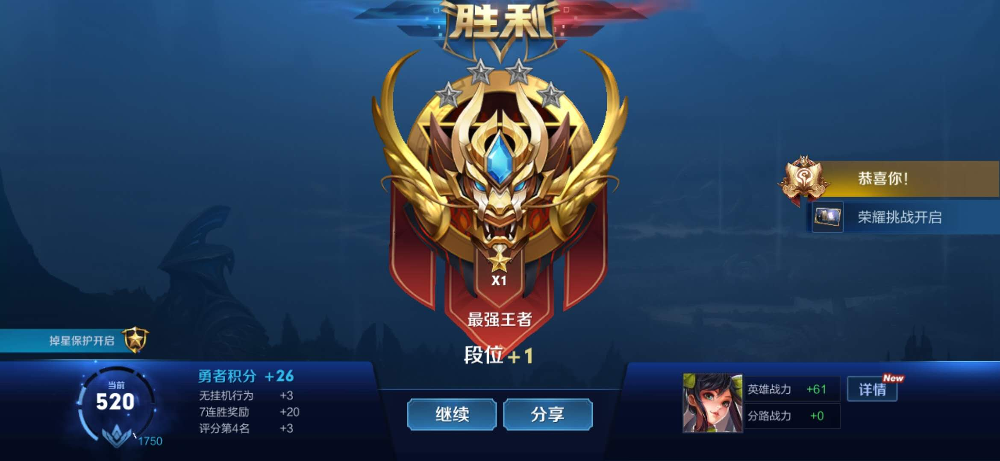

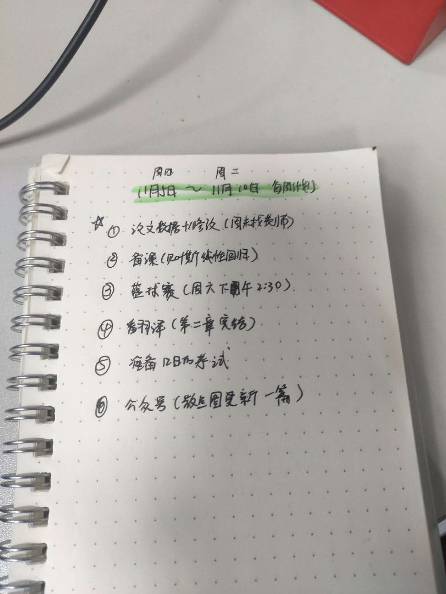

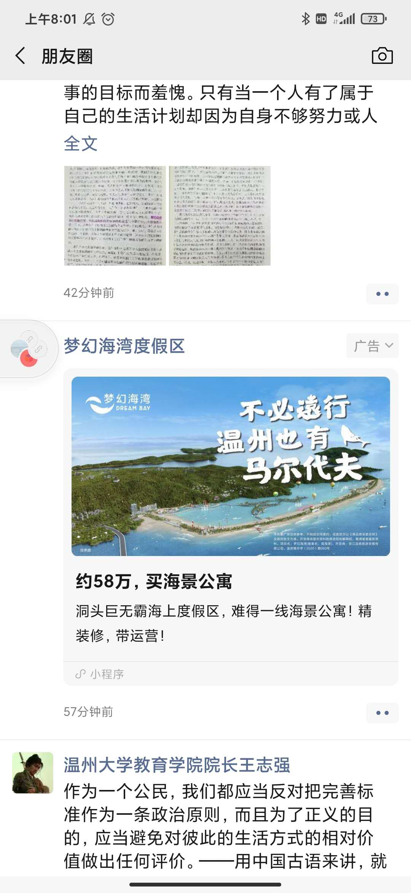

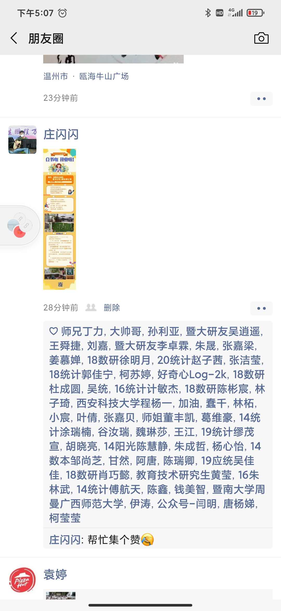

# 2020.11.06（周五 ）

## 今日时间表

-   9：00 - 9：30 调试电脑markdown+ 记笔记

-   9：30 - 11：00 代码整理+叙述 response

回寝室-洗衣服+午睡+看书（局外人）

-   14：00 - 17：00 贝叶斯回归

## 今日所学

## 今日所思

# 2020.11.06（周六 汤老师贝叶斯课 + 篮球比赛 + 受伤休息）

## 今日时间表

-   9：00 - 11：30 汤老师贝叶斯课程

-   13：00 - 17:00 篮球比赛+帮老师拿快递+ 王者

-   18：00 - 22：00 屁股受伤，躺在床上

## 今日所学

### 贝叶斯课程北航

前沿方向探讨：

-   机器学习结合可靠性

-   混合数据结合

-   inla与可靠性的结合（正在做的东西）

**感想**：
老师上的是贝叶斯的知识，正好是我不会的，没有系统学习。那这次正好老师把贝叶斯中重要的算法都介绍了一遍，虽然比较笼统，但是还是学到很多东西。接下来抽时间把老师的课件再学习一遍。

介绍几种基于马尔科夫链的抽样方法:

1.  Metropolis-Hastings算法

2.  Metropolis算法

3.  随机游动的MH算法

4.  独立的MH算法

5.  Gibbs抽样方法

6.  逐分量的MH算法

## 今日所思

### 研究生篮球比赛

害，作为替补，怒拿5分吧，一个好助攻，一个失误。总的来说还是打得不错的。可惜最后摔了一下，侧着的屁股着地，非常的疼。害。

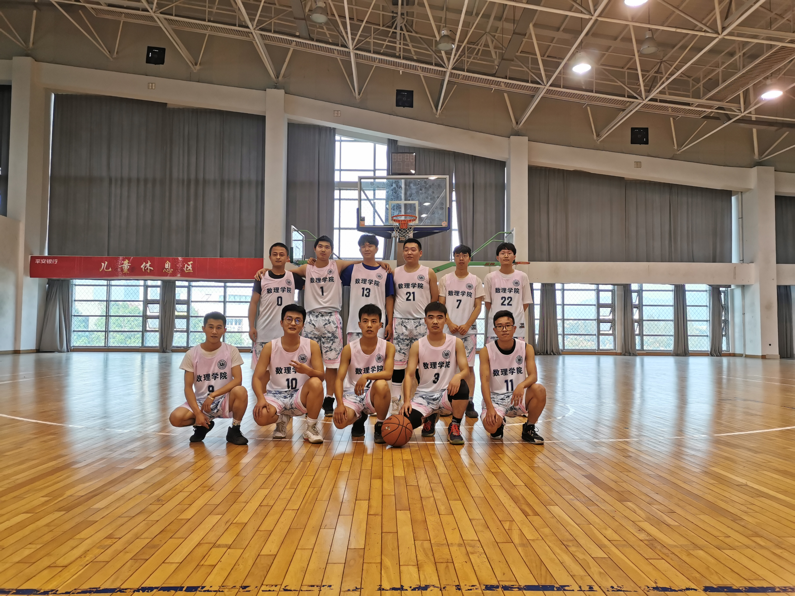

今晚本来想回来学习的，但是屁股却越来越疼了，害。算了睡会，玩会吧。看会nba以前的比赛。

晚上去老师那拿了快递，老师竟然又买房了，这生活可以的。真希望我啥时候。。。害，羡慕

今天老师说了，时间差不多了，抓紧了我要。

汤老师今天的课讲的非常的好！！赞，向他学习。
